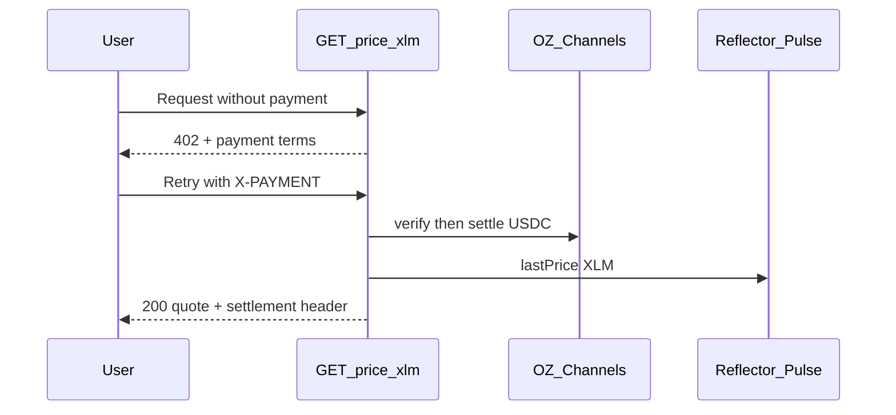

# Paid XLM Price API

A small **Next.js** demo that sells one endpoint with **x402** on Stellar testnet. After USDC payment is verified and settled through **OZ Channels**, the server reads **Reflector Pulse** and returns the current XLM price.

```text
GET /price/xlm              →  402 Payment Required
GET /price/xlm + X-PAYMENT  →  verify + settle  →  Pulse  →  200 JSON
```

**Full walkthrough (Mermaid flows, stack references, expansion ideas):** [docs/HOW_IT_WORKS.md](docs/HOW_IT_WORKS.md)

## How it works (overview)



| Layer | What we use |
|-------|-------------|
| Payments | [x402](https://www.x402.org/) on Stellar via [@x402/next](https://www.npmjs.com/package/@x402/next) + [OZ Channels](https://channels.openzeppelin.com/) |
| Settlement asset | Circle testnet USDC (classic trustline + SAC) |
| Price data | [Reflector Pulse](https://reflector.network/pulse) on Soroban testnet RPC |
| Explorer | [StellarExpert](https://stellar.expert/explorer/testnet) links in the UI and `npm run buy` |

Want to contribute? See **[Ideas to improve or expand](docs/HOW_IT_WORKS.md#ideas-to-improve-or-expand)** in the flow doc.

## What you get

| Piece | Purpose |
|-------|---------|
| [`GET /price/xlm`](app/price/xlm/route.ts) | Paid API (x402 + Reflector) |
| [`GET /openapi.json`](app/openapi.json/route.ts) | Advisory discovery (runtime **402** is authoritative) |
| [`POST /api/demo-pay`](app/api/demo-pay/route.ts) | Home-page “pay and fetch” (uses server-side payer key) |
| Home UI | Step-by-step walkthrough; results open in **modals** with [StellarExpert](https://stellar.expert) links |
| [`scripts/buy-price.mjs`](scripts/buy-price.mjs) | CLI paying agent (same flow as the UI pay button) |

## Prerequisites

- Node.js 22+
- Recipient + payer on testnet with **USDC trustlines** (Circle testnet issuer)
- [OZ Channels testnet API key](https://channels.openzeppelin.com/testnet/gen)
- **Testnet USDC on the payer** — [Circle faucet](https://faucet.circle.com/) (Stellar testnet). Friendbot only funds XLM.

## Quick start

```bash
npm install
npm run setup          # or: node scripts/setup.mjs
```

1. Set `OZ_API_KEY` in `.env.local` (from OZ Channels link above).
2. Fund the **payer** `G…` with testnet USDC (script prints the address).
3. Start the app:

```bash
npm run dev
```

Open [http://localhost:3000](http://localhost:3000).

1. **Request Without Payment** — modal shows **402** terms ($0.001 USDC, network, recipient).
2. **Pay and Get XLM Price** — modal shows the Reflector quote and a **View Payment on StellarExpert** link.

Each paid click spends another **$0.001** USDC from the payer in `.env.local`.

### CLI / curl

**Unpaid (expect 402):**

```bash
curl -i http://localhost:3000/price/xlm
```

Payment terms are in the `PAYMENT-REQUIRED` header (base64 JSON), not the body.

**Paying agent:**

```bash
npm run buy            # or: node scripts/buy-price.mjs
```

On success, the script prints the quote and a StellarExpert URL for the settlement transaction.

## Environment

Copy [`.env.example`](.env.example).

| Variable | Role |
|----------|------|
| `STELLAR_RECIPIENT` | Classic `G…` that receives USDC (needs trustline) |
| `OZ_API_KEY` | OZ Channels Bearer token (required for x402) |
| `STELLAR_SECRET_KEY` | Payer `S…` for `npm run buy` and `POST /api/demo-pay` |
| `REFLECTOR_PUBLIC_KEY` | Any valid `G…` for Pulse read simulations |
| `REFLECTOR_PULSE_CONTRACT_ID` | Pulse oracle `C…` (default: testnet CEX/DEX feed) |
| `NEXT_PUBLIC_APP_URL` | Base URL for links and the demo pay route (default `http://localhost:3000`) |

Missing `STELLAR_RECIPIENT` or `OZ_API_KEY` → **`GET /price/xlm` returns 503** (fail closed, never a free quote).

### Deploying on Vercel

Copy the same env vars into the Vercel project (Production). **`GET /price/xlm` returning 402 only proves x402 is configured** — `POST /api/demo-pay` also needs `STELLAR_SECRET_KEY` and USDC on that payer.

| Check | Why |
|-------|-----|
| Do **not** set `NEXT_PUBLIC_APP_URL` to `http://localhost:3000` on Vercel | Server-side pay would call localhost and fail. Omit it or use `https://your-app.vercel.app`. |
| **Deployment Protection** enabled | Add [Protection Bypass for Automation](https://vercel.com/docs/security/deployment-protection/methods-to-bypass-deployment-protection/protection-bypass-automation) as `VERCEL_AUTOMATION_BYPASS_SECRET` |
| `REFLECTOR_PUBLIC_KEY` | Any valid `G…`, or rely on `STELLAR_RECIPIENT` / payer public key (auto-fallback) |
| Payer has testnet USDC | Same Circle faucet as local |

The `Buffer()` deprecation line in logs comes from a dependency; it is not the payment failure.

> **Demo security:** `STELLAR_SECRET_KEY` on the server is for **local learning only**. Do not deploy `POST /api/demo-pay` to production with a funded key; use a wallet or a dedicated agent process instead.

## Reflector feed

Default: **External CEX/DEX** Pulse on testnet (`CCYOZJCOPG34LLQQ7N24YXBM7LL62R7ONMZ3G6WZAAYPB5OYKOMJRN63`) with `lastPrice("XLM")`.

The testnet Pubnet-DEX oracle does not currently expose native XLM the same way; confirm feeds on [reflector.network/pulse](https://reflector.network/pulse) before changing `REFLECTOR_PULSE_CONTRACT_ID`.

If `lastPrice` is empty after payment verification, the API returns **502**. With `withX402`, failed responses are not settled, so the client is not charged for a missing oracle quote.

## Project layout

```text
app/
  page.tsx                 # Walkthrough UI
  price/xlm/route.ts       # x402-gated price API
  api/demo-pay/route.ts    # Server-side payer for the UI
  openapi.json/route.ts    # Discovery document
lib/
  x402/                    # Facilitator, buy helper, payer checks
  reflector/               # Pulse client + quote formatting
  stellar-expert.ts        # Explorer URL helpers
components/
  walkthrough.tsx          # Steps + modals
  result-modal.tsx
scripts/
  setup.mjs
  buy-price.mjs
```

## Documentation

| Doc | Contents |
|-----|----------|
| [docs/HOW_IT_WORKS.md](docs/HOW_IT_WORKS.md) | User flows (Mermaid), payment sequence, stack links, jump-in / roadmap table |
| [AGENTS.md](AGENTS.md) | AI agent guardrails, fail-closed rules, Raven + skills |

## Agent workflow

See [`AGENTS.md`](AGENTS.md) for Raven, Stellar agent skills, and guardrails.

## Scripts

| Command | Description |
|---------|-------------|
| `npm run dev` | Next.js dev server |
| `npm run setup` | Keypairs, Friendbot, trustlines, `.env.local` stub |
| `npm run buy` | x402 client for `/price/xlm` + StellarExpert tx link |

## Optional tooling

- [Stellar CLI](https://developers.stellar.org/docs/tools/cli) — inspect accounts and contracts
- [Stellar Lab](https://lab.stellar.org/) — trustlines and payments
- [StellarExpert](https://stellar.expert/explorer/testnet) — transactions and accounts on testnet
