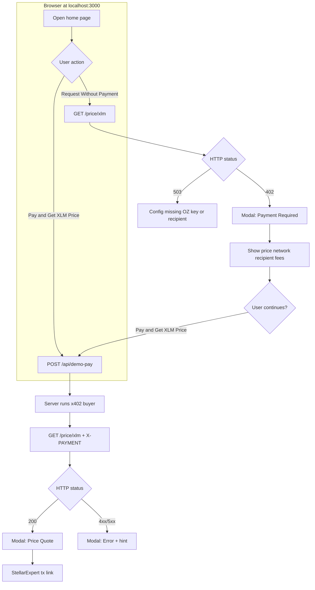
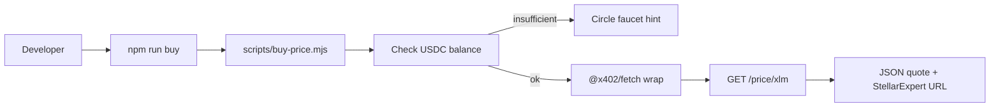
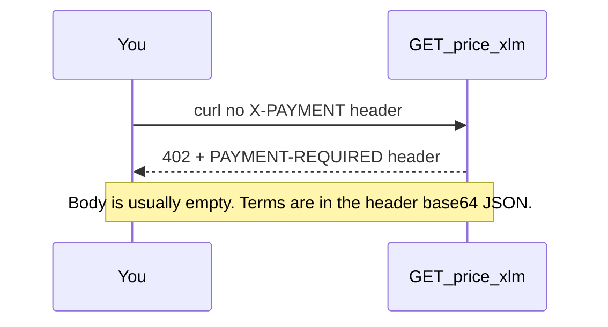
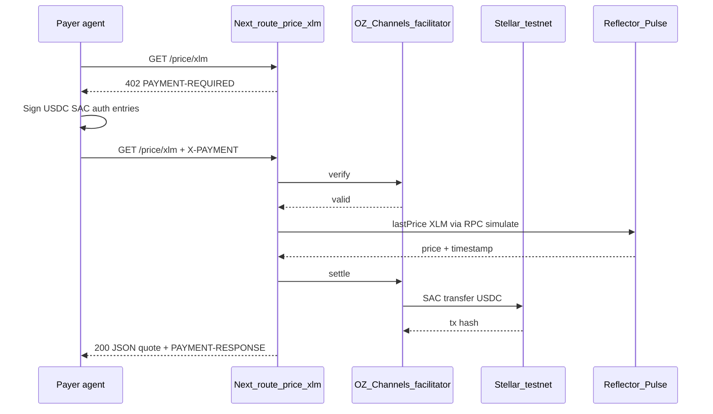
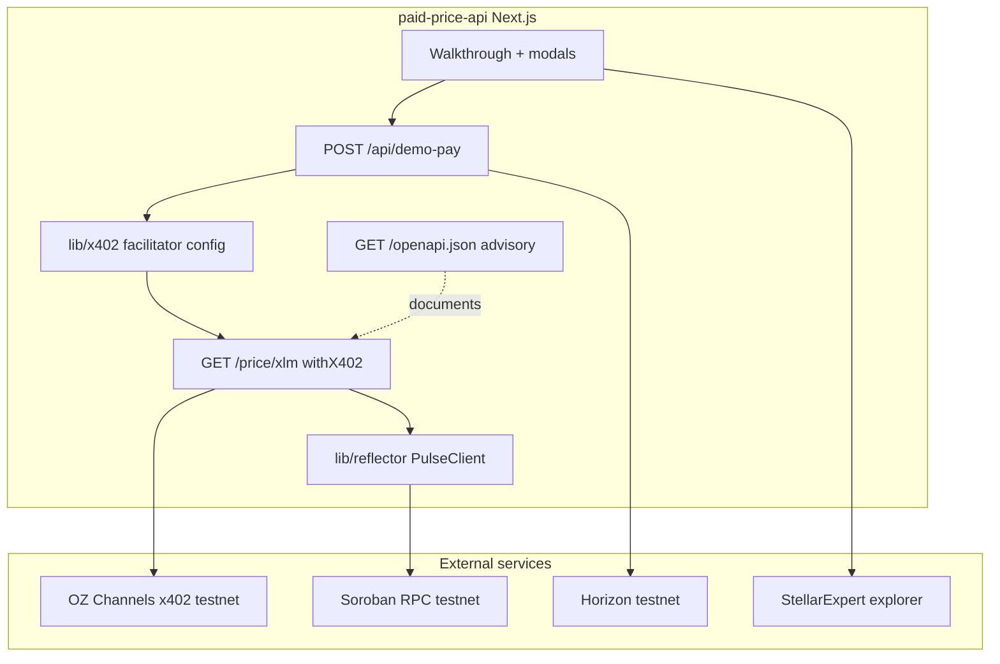

# How it works

This doc is for humans and agents: **user flows**, **payment + oracle sequence**, **what we depend on**, and **where to extend** the project.

## User flows

### Home page (browser)

The UI does not sign x402 payments in the browser. Step 1 shows the **402 challenge**; step 2 calls **`POST /api/demo-pay`**, which pays from `STELLAR_SECRET_KEY` on the server (local demo only).

### CLI paying agent

Same payment path as the pay button, without the Next.js demo route.

### curl (unpaid only)

---

## Payment and price sequence (paid request)

Settlement runs through **OZ Channels** (x402 facilitator). The route handler runs **only after** verify/settle succeeds (`withX402` settles on successful responses).

**Fail-closed behaviors**

| Condition | Result |
|-----------|--------|
| No `STELLAR_RECIPIENT` or `OZ_API_KEY` | **503** — never a free quote |
| Paid request but Pulse returns no price | **502** — `withX402` does not settle on failed responses |
| Payer USDC balance below $0.001 | Simulation fails before retry (client-side) |

---

## System context

---

## Stack and references

Use these as the source of truth when changing behavior.

### Protocols and products

| Piece | Role in this repo | Learn more |
|-------|-------------------|------------|
| **x402** | HTTP 402 + machine-readable payment requirements | [x402.org](https://www.x402.org/) |
| **x402 on Stellar** | `exact` scheme, auth-entry signing, USDC SAC | [stellar/x402-stellar](https://github.com/stellar/x402-stellar) |
| **OZ Channels** | Facilitator: verify, settle, fee sponsorship | [channels.openzeppelin.com](https://channels.openzeppelin.com/) (testnet key: [gen](https://channels.openzeppelin.com/testnet/gen)) |
| **Reflector Pulse** | On-chain oracle; `lastPrice` via RPC simulation | [reflector.network/docs](https://reflector.network/docs), [pulse feeds](https://reflector.network/pulse) |
| **Stellar testnet** | Network `stellar:testnet`, Soroban + classic assets | [Stellar docs](https://developers.stellar.org/docs) |
| **Circle testnet USDC** | Classic issuer + SAC settlement asset | [Faucet](https://faucet.circle.com/), issuer `GBBD47IF6LWK7P7MDEVSCWR7DPUWV3NY3DTQEVFL4NAT4AQH3ZLLFLA5` |
| **StellarExpert** | Explorer links for tx and accounts | [testnet explorer](https://stellar.expert/explorer/testnet) |

### NPM packages (pinned in `package.json`)

| Package | Use |
|---------|-----|
| `@x402/next` | `withX402` on App Router routes |
| `@x402/core` | `HTTPFacilitatorClient`, `x402ResourceServer` |
| `@x402/stellar` | `ExactStellarScheme`, `createEd25519Signer` |
| `@x402/fetch` | Paying client (`wrapFetchWithPaymentFromConfig`) |
| `@reflector/contract-client` | `PulseClient` |
| `@stellar/stellar-sdk` | Horizon, assets, network passphrases |

### Repo map (where logic lives)

| Path | Responsibility |
|------|----------------|
| [`app/price/xlm/route.ts`](../app/price/xlm/route.ts) | Paid API gate + quote response |
| [`lib/x402/server.ts`](../lib/x402/server.ts) | Recipient resolution, facilitator, route pricing config |
| [`lib/x402/buy.ts`](../lib/x402/buy.ts) | Shared paid fetch for demo + scripts |
| [`lib/reflector/quote.ts`](../lib/reflector/quote.ts) | Pulse read + JSON shape |
| [`components/walkthrough.tsx`](../components/walkthrough.tsx) | Steps and modals |

### Skills and agents (monorepo / Cursor)

When extending Stellar behavior, prefer these playbooks:

- **Agentic payments (x402 / MPP)** — `agentic-payments` skill
- **Reflector feeds and deployments** — `reflector` skill
- **RPC / Horizon** — `data` skill
- **USDC issuer vs SAC** — `assets` skill
- **Raven MCP** — current Stellar docs and ecosystem search

See [`AGENTS.md`](../AGENTS.md) for project-specific guardrails.

---

## Ideas to improve or expand

Pick an item, open an issue or PR, or ask in your team channel. Rough effort: **S** small, **M** medium, **L** larger.

### Payments and agents

| Idea | Effort | Notes |
|------|--------|--------|
| **Browser wallet payer** (Freighter / Wallets Kit + auth entries) | L | Replace server-side `STELLAR_SECRET_KEY` demo; see x402 skill browser caveats |
| **MPP Charge mode** route alongside x402 | M | Facilitator-free path; compare in README |
| **Discovery**: richer OpenAPI + agent registry links | S | Today `/openapi.json` is advisory only |
| **Multiple prices** (`/price/btc`, `/price/eth`) | M | Shared x402 middleware config; map assets to Pulse tickers |
| **Mainnet profile** | M | `stellar:pubnet`, mainnet RPC, OZ mainnet URL, real USDC |
| **Integration tests** against testnet (gated CI) | L | Needs secrets + funded payer in CI |

### Oracle and API

| Idea | Effort | Notes |
|------|--------|--------|
| **Staleness guard** on `lastPrice` timestamp | S | Reject quotes older than N seconds; return 502 |
| **Pubnet-DEX XLM feed** when available on testnet | S | Swap `REFLECTOR_PULSE_CONTRACT_ID` + asset encoding per Pulse UI |
| **Response metadata**: oracle resolution, `base()`, feed name | S | Helps learners compare feeds |
| **Caching** (short TTL) post-payment | M | Careful: only after payment verified; don't leak quotes for free |

### UX and docs

| Idea | Effort | Notes |
|------|--------|--------|
| **Copy PAYMENT-REQUIRED** as curl example for agents | S | Modal button for developers |
| **Sequence diagram on home page** | S | Embed or link to this doc |
| **i18n / accessibility audit** | M | Modals, focus trap, `prefers-reduced-motion` |
| **Deploy to Vercel** with env docs only (no demo-pay secret) | M | Document production-safe architecture |

### Code quality

| Idea | Effort | Notes |
|------|--------|--------|
| **Extract shared types** for quote + payment response | S | Used by UI, OpenAPI, scripts |
| **Unit tests** for `usdcFromAtomic`, explorer URLs, recipient resolver | S | No network |
| **Align AGENTS.md** with CEX/DEX default feed | S | Keep agent context accurate |

### How to jump in

1. Read [Quick start](../README.md#quick-start) and run the UI + `npm run buy` once on testnet.
2. Skim the diagrams above and set breakpoints in [`app/price/xlm/route.ts`](../app/price/xlm/route.ts) and [`lib/x402/buy.ts`](../lib/x402/buy.ts).
3. Choose a row from the tables — comment on an issue with your approach before large changes.
4. For Stellar protocol questions, use **Raven** + skills rather than guessing contract IDs or feed addresses.
